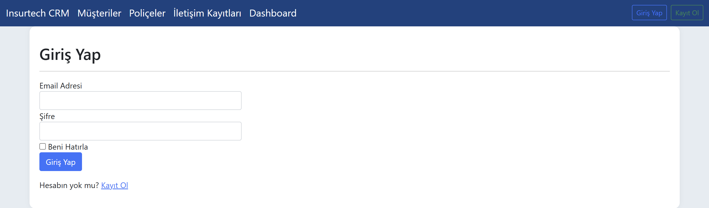
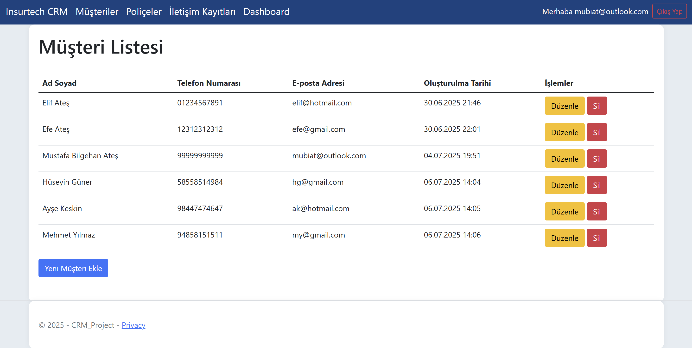
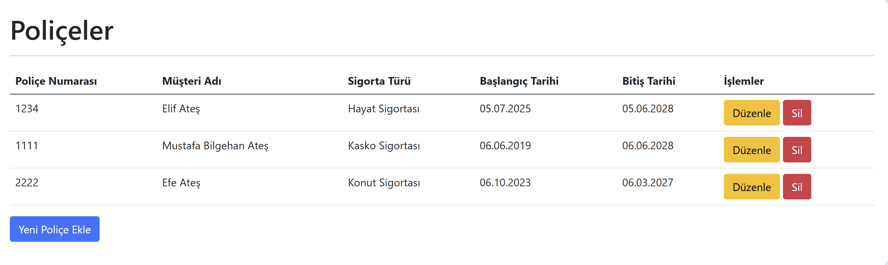
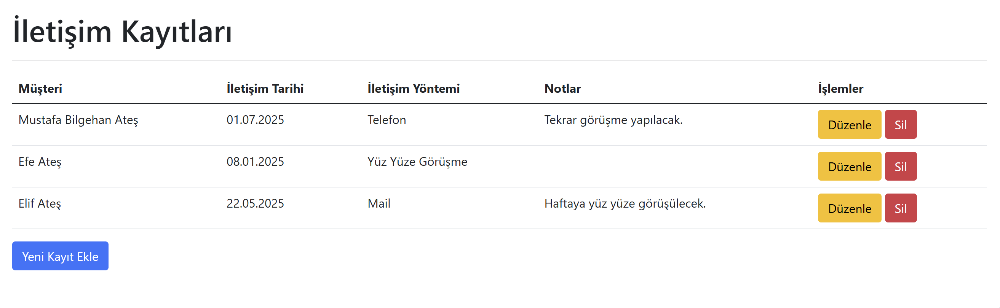
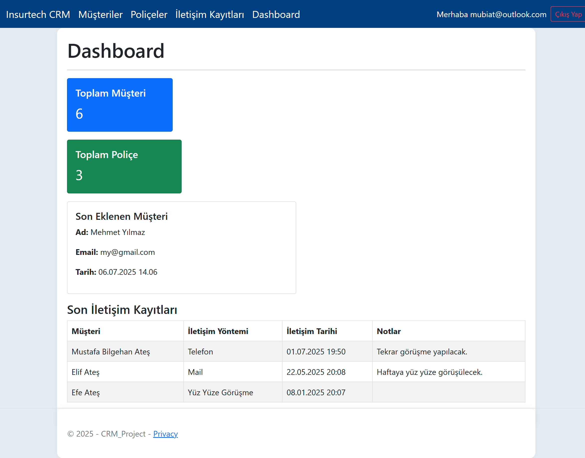

# Insurtech CRM

Insurtech CRM is a simple yet functional web-based CRM system tailored for the insurance industry. Built with ASP.NET Core MVC and Entity Framework Core, it helps manage customers, policies, and contact logs effectively.

## 📷 Screenshots







## 🎯 Features

- 🔐 User registration and login (with validation)
- 👥 Customer management (CRUD)
- 📄 Insurance policy management (CRUD)
- 📞 Contact log tracking (CRUD)
- 📊 Dashboard with key metrics and recent activities
- 🛡️ Authentication with ASP.NET Identity
- 🎨 Clean Bootstrap-based UI

## 🛠️ Tech Stack

- ASP.NET Core MVC (.NET 8)
- Entity Framework Core
- SQL Server
- Bootstrap 5
- C#

## ⚙️ Setup Instructions

1. Clone the repo:
    ```
    git clone https://github.com/username/Insurtech_CRM.git
    cd Insurtech_CRM
    ```

2. Open in Visual Studio

3. Update `appsettings.json` with your local SQL Server connection string.

4. Run the following to apply migrations:
    ```
    Update-Database
    ```

5. Press `F5` or run the app.

> Default URL: `https://localhost:xxxx/`

## 🧪 Test User

You can register a new user and log in directly.


## 📌 Note

This project was built as part of a personal learning project before an internship at an insurtech company. It demonstrates CRUD operations, identity management, and basic dashboard functionality for insurance CRMs.

## 📝 License

This project is for educational/demo purposes.
